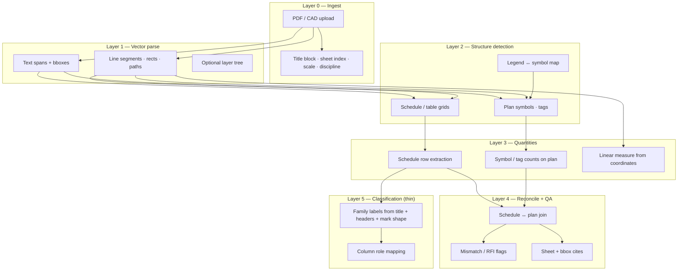

# Vector takeoff engine research — commercial practice + complete OSS stack

**Status:** AUTHORITATIVE (2026-09-01)  
**Trigger:** Pillar C audit proved **63/81 valve-bearing sets have valve language in the PDF
but compile returns 0 rows**. Regex/title tuning on `corpusTakeoff.mjs` cannot fix that —
the failure is **upstream table extraction and structural classification**, not downstream
family matching.  
**Policy:** GOAL non-negotiable #11 — shared Session + ODL path only. No UI/MCP fork.

---

## 1. Executive verdict

You are correct: **regex is not the engine**. Commercial takeoff products (Kamai, Trimble
MEP, iBeam/Beam AI, and the best open-source MEP tools) all start from **native PDF/CAD
vector geometry** — text positions, line segments, rectangles, layers, and scale — then
build structured tables and symbol inventories, and **only then** apply lightweight
classification rules (title phrases, column headers, mark patterns) to label what was
already extracted geometrically.

OpenTakeoff already has the right **architecture** (`sheetgraph.ts` geometric extraction +
OpenDataLoader-PDF adapter + reconcile). The Pillar C gap is that **Layer 1 (find tables
as geometry) fails on ~24/70 compile-zero valve sets** and **Layer 2 (classify untitled
tables by header/column shape) fails on ~46/70** — so `corpusTakeoff.mjs` never receives
rows to classify. Tweaking `titleRe`/`keyRe` without fixing extraction is polishing the
wrong floor.

**Do not treat compile-empty as verified-empty.** The PDF text audit (`pillarCValvePdfTextScan.mjs`)
showed **0/81 PDFs with zero valve/damper text** and **63/81 compile-zero with PDF signal**.

---

## 2. How commercial engines actually work

Sources: Kamai product/docs/blog; Trimble MEP/Accubid announcements (2026); iBeam/Beam AI
HVAC + schedule-reconciliation articles; MEPdetect README (vector vs raster paths); industry
HVAC takeoff practice (Simpro, BuildCrux multi-pass workflows).

### 2.1 Shared pipeline shape (all serious products)

Every credible MEP takeoff engine follows the same multi-pass shape:



**Regex/title rules live only in Layer 5.** They label tables and rows that Layers 1–3
already recovered as geometry. When Layer 1 returns zero tables, Layer 5 has nothing to
match — exactly what the 70 compile-zero valve sets demonstrate.

### 2.2 Kamai (foundational models on vector geometry)

Public documentation is explicit:

| Claim | Mechanism | Source |
|---|---|---|
| Reads **native vector geometry**, not rasterized pixels | Parses PDF/CAD coordinates directly; duct lengths computed from drawing coordinates | [Kamai mechanical HVAC takeoff](https://kamai.io/blog/how-to-do-mechanical-and-hvac-takeoffs) |
| Foundational models trained on construction drawings | In-house models distinguish walls vs gridlines, door swings vs arcs, room boundaries vs hatches | [Kamai AI takeoff overview](https://kamai.io/learn/ai-construction-takeoff) |
| MEP: equipment schedules + M-series plans + sections + legends | Two estimator-time jobs: **measure duct from coordinates** + **link scheduled tags to plan** | Kamai mechanical blog |
| Output = structured JSON with sheet/layer traceability | API + MCP; quantities not prices | [Kamai PDF takeoff API](https://kamai.io/blog/how-construction-pdf-takeoff-api-works) |
| Accepts scanned PDFs too | Hybrid path when vector text absent (OCR) — out of scope for our GOAL unless reopened | Kamai FAQ |

**Implication for OpenTakeoff:** Kamai’s “AI” is not an LLM reading prose — it is
**geometry-first extraction + learned classifiers** over vector features. Our deterministic
equivalent is sheetgraph + ODL + (optional) TATR/gmft for hard grids — not more regex on
empty `graph.tables`.

### 2.3 Trimble MEP / Accubid (2026 AI layer)

Trimble’s 2026 MEP release emphasizes **pre-takeoff automation on vector sheets**:

| Capability | What it automates |
|---|---|
| Scale + sheet naming | AI sets scale across full plan set before measurement |
| Count takeoff | Symbol recognition (receptacles, fixtures, …) — 3M+ symbols reported |
| Length takeoff | Auto-routing for conduit including vertical rises |
| Smart assistant | NL queries over **already-extracted** estimate data |

Trimble still separates **graphical takeoff (LiveCount)** from **spec-driven estimating
(Accubid)** — same architectural split as OpenTakeoff’s compile vs reconcile.

**Implication:** Even “AI” MEP takeoff keeps **geometry extraction** and **pricing** separate.
OpenTakeoff’s shared path is aligned; we need extraction recall, not estimator pricing.

### 2.4 iBeam / Beam AI (schedule-first + reconcile)

Beam AI’s public HVAC workflow matches Pillar B/C:

1. Read title blocks, **equipment/diffuser/VAV schedules**, plan symbols, legends.
2. **Schedule quantities are authoritative** for equipment counts; plans verify placement.
3. **Schedule-to-plan reconciliation** flags schedule∖plan and plan∖schedule mismatches
   (RFI-grade, not silent overcount).
4. Human QA on structured output before bid.

**Implication:** Reconcile is product, not polish — OpenTakeoff Pillar B is the right
shape. Pillar C fails today because **schedule rows never enter the graph** on most sets.

### 2.5 MEPdetect (best public description of vector vs raster)

MEPdetect documents two distinct paths in one product:

| Input | Path | Mechanism |
|---|---|---|
| **Vector PDF** | Native | Pen/lineweight isolation, arrowhead geometry, hash marks, **text as real text**; connectivity on segments |
| Raster / scan | Fallback | Binarize → thin → curve recovery → YOLO11 symbols |

This is the clearest OSS statement of what “read vector geometry” means in practice:
**use the drawing’s own linework and text layer before touching pixels.**

OpenTakeoff GOAL policy: stay on the vector path; honest refuse on raster-only fixtures
(e.g. itd-d1-lab-raster).

---

## 3. OpenTakeoff today — what is already geometric

| Component | Layer | Role |
|---|---|---|
| `session.ts` + pdf.js | L0–L1 | Load PDF; emit `GraphSpan` text + vector segments |
| `sheetgraph.ts` `extractAllTables` | L2 | Geometric table detection (header tiers, quarter-turn, banding) |
| `sheetgraph.ts` ODL adapter (~7327+) | L2 | Deterministic grid from OpenDataLoader JSON; snap bboxes to pdf.js spans |
| `mcp/src/opendataloader.ts` | L2 | Runs ODL CLI; feeds adapter |
| `corpusTakeoff.mjs` | L5 | Family specs, `titleRe`/`keyRe`, column normalize — **after** tables exist |
| `reconcileWorkflow` / `sweep_schedule_row` | L4 | Schedule tag → plan text join |

**Smoking gun (013_MO_T2523):** Graph contains a **blank-title** table with headers
`TAG, MANUFACTURER, MODEL, SERVED, GPM, SIZE` and marks `CV-7`…`CV-12`. Geometry
extraction **succeeded**; compile returned 0 because `uniqueFamily()` required a titled
`CONTROL VALVE` match and `keyRe` did not admit `CV-*` — a Layer 5 bug **on top of**
recovered geometry, not a regex-only pipeline.

**Smoking gun (058_LBNL):** Graph has ~6 non-HVAC tables only — Layer 1 failure on
rejoined multipart set (“311 sheets / thin tables”).

---

## 4. Complete open-source stack (recommended layers)

This is a **full stack a Kamai-class deterministic pipeline can be built from today**
without proprietary models. Items marked **(in repo)** are already integrated.

### Layer 0 — Document ingest

| Tool | License | Role | Notes |
|---|---|---|---|
| **pdf.js** (Mozilla) | Apache-2.0 | Browser + Node PDF render; text/content streams | **(in repo)** via Session |
| **PyMuPDF (fitz)** | AGPL / commercial | Fast vector text + path extraction; used by autoConst-style indexers | Optional batch sidecar |
| **Aspicio** `@aspicio/core` | MIT | DXF + vector PDF parse → structured JSON; MCP server | Strong for CAD-native uploads |
| **pdfium** (via `@hyzhyz/pdf-lib` / PyPDFium2) | Apache / BSD | High-throughput page rasterization when needed | gmft, MEPdetect use PyPDFium2 |

### Layer 1 — Vector text + geometry primitives

| Tool | License | Role | Notes |
|---|---|---|---|
| **pdfminer.six** | MIT | Character-level layout analysis | Backend for pdfplumber |
| **pdfplumber** | MIT | Characters, rects, curves — **debuggable** layout primitives | Best for custom table finders |
| **PyMuPDF** | AGPL | Words/lines/paths with bboxes | autoConst `build` step |
| **Session `GraphSpan` + segments** | Apache-2.0 | OpenTakeoff native representation | **(in repo)** shared path |

### Layer 2 — Table / schedule grid detection

Priority order for **construction schedules** (bordered + borderless):

| Tool | License | Mode | Best for | OpenTakeoff fit |
|---|---|---|---|---|
| **OpenDataLoader-PDF** | Apache-2.0 | Rule + optional hybrid (Docling) | Multi-tier headers, complex merges, 47-col AHU grids | **(in repo)** — extend coverage, don’t rewrite |
| **Camelot** 2.x | MIT | `lattice` (ruled) / `stream` (whitespace) / optional `ml` (TATR + PDF text fill) | Bordered spec/schedule tables; confidence scores | Sidecar validator or fallback when sheetgraph misses |
| **pdfplumber** `.extract_tables()` | MIT | Coordinate-driven | Borderless / irregular columns | Good for 013-style header+row grids |
| **gmft** | MIT | Microsoft Table Transformer (TATR) | Implicit structure, merged cells; ~10× faster than unstructured on CPU | Fallback for borderless valve/BAS grids |
| **tablers** | MIT | Rust + pdfium | Ruled grids, fast | Batch corpus pre-pass |
| **sheetgraph `extractAllTables`** | Apache-2.0 | Custom geometric | Quarter-turned sheets, equipment schedules | **(in repo)** — primary |

**Hybrid strategy (recommended):**

1. **Primary:** sheetgraph geometric + ODL on hard pages (current shared path).
2. **Fallback A:** pdfplumber stream table on pages where ODL/sheetgraph return 0 HVAC
   tables but pdf.js text hits `VALVE SCHEDULE|POINTS LIST|I/O LIST`.
3. **Fallback B:** Camelot `lattice` on pages with visible grid lines (detect via line
   segment density in Session segments).
4. **Fallback C:** gmft/TATR only for pages that fail A+B **and** pass vector-text gate
   (not scanned-only — GOAL policy).

All fallbacks must emit **`ScheduleTable`-compatible** rows into the same graph slot ODL
uses today — one adapter pattern, not a parallel MCP-only fork.

### Layer 3 — Plan symbols, tags, and linear quantities

| Tool | License | Role | Notes |
|---|---|---|---|
| **OpenTakeoff `sweep_schedule_row` / inline motifs** | Apache-2.0 | Tag text search on plan sheets | **(in repo)** Pillar B/D |
| **MEPdetect** | AGPL | YOLO11 symbols + **vector** circuit trace | Electrical-first; vector path is the model |
| **YOLOplan** (DynMEP) | AGPL | YOLO11 MEP symbol detection | HVAC/electrical counts; custom training |
| **OpenConstructionERP CV pipeline** | Apache-2.0 | YOLOv11 + PaddleOCR PDF takeoff | Reference architecture for integrated ERP |
| **ConstructDrawingAI** | (see repo) | L0–L4 detection + connectivity graphs | Research-grade multi-discipline |
| **autoConst-drawing-takeoff** | (see repo) | PyMuPDF index + SQLite + schedule pages | Closest “estimator brain” OSS — vector text DB |
| **Kamai-class duct LF** | — | Coordinate polyline measure | **Out of scope** (GOAL duct-LF deferred) |

For Pillar C valves/BAS: **schedule row extraction (Layer 2) is the blocker**, not symbol
YOLO. Symbol detectors matter for Pillar D plan counts and reconcile paints.

### Layer 4 — Reconcile, cites, QA

| Tool | License | Role | Notes |
|---|---|---|---|
| **OpenTakeoff `reconcileWorkflow`** | Apache-2.0 | MATCH / SCHEDULE_ONLY / PLAN_ONLY | **(in repo)** |
| **iBeam-style mismatch surfacing** | — | Product pattern: flag schedule∖plan | Already Pillar B charter |
| **autoConst `check` / sanity** | — | Cross-check dims vs building envelope | Pattern for refuse/disclose |

### Layer 5 — Classification (thin — regex is allowed **here only**)

| Signal | Use |
|---|---|
| Table **title** text (when present) | Primary family hint |
| **Header row** token sets (`TAG`, `GPM`, `Cv`, `SERVED`, `AI`, `AO`, `BI`, `BO`) | Untitled table family inference (013 fix belongs here) |
| **Mark shape** (`CV-\d`, `VAV-\d`, `EF-\d`) | Row admission per family |
| Column **role map** (`columnMapFor`) | Contractor columns |

**Not sufficient alone:** title regex without Layer 2 rows (current 70-set failure mode).

---

## 5. Reference OSS “full stack” compositions

### 5.1 Deterministic MEP schedule takeoff (closest to OpenTakeoff GOAL)

```
pdf.js Session load
  → sheetgraph.extractAllTables + ODL adapter
  → [fallback] pdfplumber/Camelot/gmft → ScheduleTable adapter
  → corpusTakeoff family + column classify
  → reconcileWorkflow plan join
  → structured JSON + bbox cites
```

**Repos to study/implement against:**

| Project | URL | Why |
|---|---|---|
| OpenDataLoader-PDF | https://github.com/opendataloader-project/opendataloader-pdf | **Already integrated** — extend page coverage |
| autoConst drawing takeoff | https://github.com/Jacobslh/autoConst-drawing-takeoff-claude | PyMuPDF → SQLite; schedule page detection |
| gmft | https://github.com/conjuncts/gmft | TATR fallback for borderless grids |
| Camelot | https://github.com/camelot-dev/camelot | Ruled schedule lattices + confidence |
| pdfplumber | https://github.com/jsvine/pdfplumber | Layout debugger for failed sets |

### 5.2 Symbol + circuit takeoff (Pillar D depth)

```
PDF → vector path (MEPdetect) OR YOLOplan detect
  → tag counts + optional netlist
  → reconcile to schedule tags (shared OpenTakeoff join)
```

| Project | URL | License |
|---|---|---|
| MEPdetect | https://github.com/DynMEP/MEPdetect | AGPL |
| YOLOplan | https://github.com/DynMEP/YOLOplan | AGPL |
| OpenConstructionERP | https://github.com/openbim/OpenConstructionERP | Apache-2.0 |

**License note:** AGPL sidecars (MEPdetect, YOLOplan, PyMuPDF) require careful deployment
if networked as a service — prefer **batch offline corpus tools** or MIT/Apache components
(ODL, gmft, Camelot, pdfplumber, Aspicio) on the shared path.

### 5.3 Agent-native CAD/PDF engine

| Project | URL | Notes |
|---|---|---|
| Aspicio | https://github.com/frontsail-ai/aspicio | MIT; MCP + HTTP API; DXF + vector PDF |
| OpenTakeoff MCP | **(in repo)** | 40 tools; Session pipeline |

---

## 6. Root-cause map for 70 compile-zero valve sets

| Bucket | ~Count | Failure layer | Fix class |
|---|---:|---|---|
| `[ZERO]` — almost no tables in graph | ~24 | **L1/L2** extraction | ODL on more sheets; multipart rejoin graph build; pdfplumber/Camelot fallback pages |
| HVAC tables but 0 valve rows | ~46 | **L2/L5** untitled or mis-titled | Header+mark classification; admit `CV-*` via column shape; blank-title `ScheduleTable.title` inference |
| PDF text hits tabular schedule language, compile 0 | 17 | **L2** (subset of above) | Targeted fallback on pages with schedule keywords + grid evidence |

**Wrong fix:** expand `titleRe` only.  
**Right fix:** ensure valve schedule **grids exist in `graph.tables`**, then classify by
**header geometry + mark patterns**.

---

## 7. Recommended implementation order (shared path)

When Pillar C resumes — **this order, no regex-first shortcuts:**

1. **Table recall audit** — per compile-zero set: count `graph.tables` by kind; list pages
   with schedule keywords vs extracted tables (extend `pillarCDepthZeroFloor.mjs`).
2. **ODL coverage expansion** — run ODL on pages/sheets where sheetgraph returns thin tables
   (reuse `opendataloader.ts`; no ODL rewrite per NEXT_GOAL_LOOP).
3. **ScheduleTable fallback adapter** — pdfplumber or Camelot → same types ODL adapter uses;
   gate on vector-text + line density; unit tests on 013, 058, 019 negatives.
4. **Untitled table classifier in sheetgraph/corpusTakeoff** — header token sets + mark
   `keyRe` from column 0; **not** title-only `uniqueFamily()`.
5. **Re-run** `pillarCValvePdfTextScan.mjs` + compile census; measure **graph.tables with
   valve marks**, not compile alone.
6. **Pillar B reconcile** unchanged — joins only after rows exist.

---

## 8. Explicit non-answers (do not pursue as primary engine)

| Approach | Why not |
|---|---|
| Regex on PDF text scan | Proves signal exists; does not extract row/column structure |
| LLM reading schedules | Violates GOAL deterministic mandate |
| Raster OCR / vision-first | Out of scope unless user reopens; wrong physics for vector-dense Vol2 |
| Per-set hardcodes | Violates set-agnostic rule |
| Scoring by weakening keys | PROGRESS policy #7 |

---

## 9. Success criteria for “engine fixed”

Replace “compile row count” with **geometry-backed metrics**:

| Metric | Target |
|---|---|
| Valve-bearing sets with ≥1 **extracted** valve/damper schedule table in graph | 81/81 (or honest refuse with evidence) |
| Sets with `control_valves` compile rows | Should track extracted tables, not precede them |
| Every compile row has **cell bbox cite** | Already required — keep |
| Reconcile MATCH/SCHEDULE_ONLY | Pillar B — after extraction |

---

## 10. References

- Kamai: https://kamai.io/learn/ai-construction-takeoff , https://kamai.io/blog/how-to-do-mechanical-and-hvac-takeoffs , https://kamai.io/blog/how-construction-pdf-takeoff-api-works
- Trimble MEP AI (2026): https://news.trimble.com/New-Trimble-AI-Takeoff-Capabilities-Cut-MEP-Estimating-Time-and-Increase-Accuracy
- iBeam schedule reconciliation: https://www.ibeam.ai/insight/the-schedules-on-a-drawing-set-that-hold-the-real-quantities
- OpenDataLoader-PDF: https://github.com/opendataloader-project/opendataloader-pdf
- Camelot comparison matrix: https://camelot-py.readthedocs.io/en/latest/user/comparison.html
- gmft: https://github.com/conjuncts/gmft
- MEPdetect: https://github.com/DynMEP/MEPdetect
- YOLOplan: https://github.com/DynMEP/YOLOplan
- autoConst: https://github.com/Jacobslh/autoConst-drawing-takeoff-claude
- Aspicio: https://github.com/frontsail-ai/aspicio
- OpenTakeoff sheetgraph ODL adapter: `opentakeoff/web/src/lib/sheetgraph.ts` (~7327)
- Pillar C PDF audit: `opentakeoff/mcp/scripts/pillarCValvePdfTextScan.mjs`
