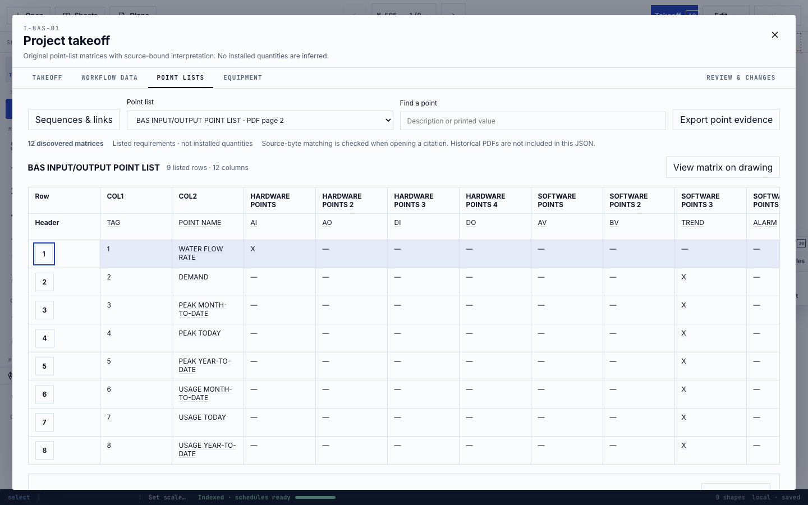
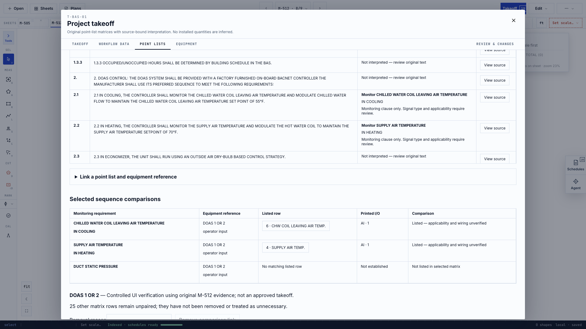
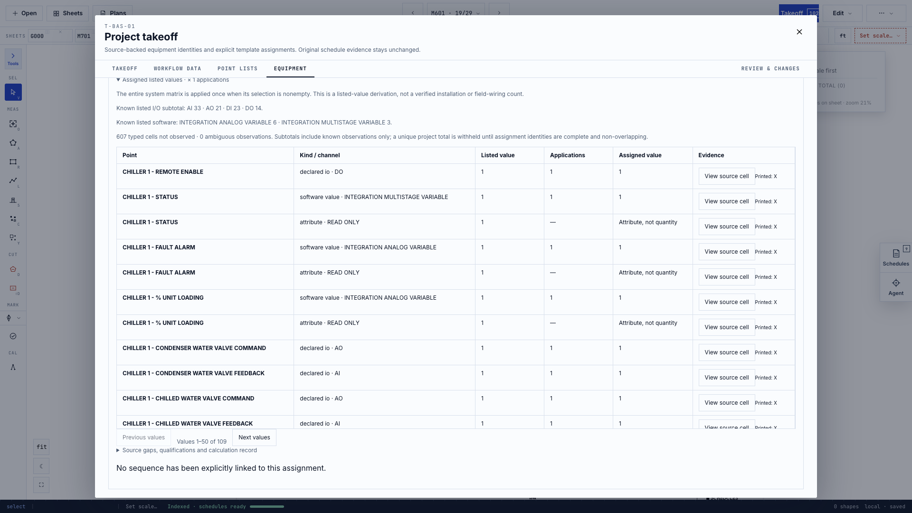
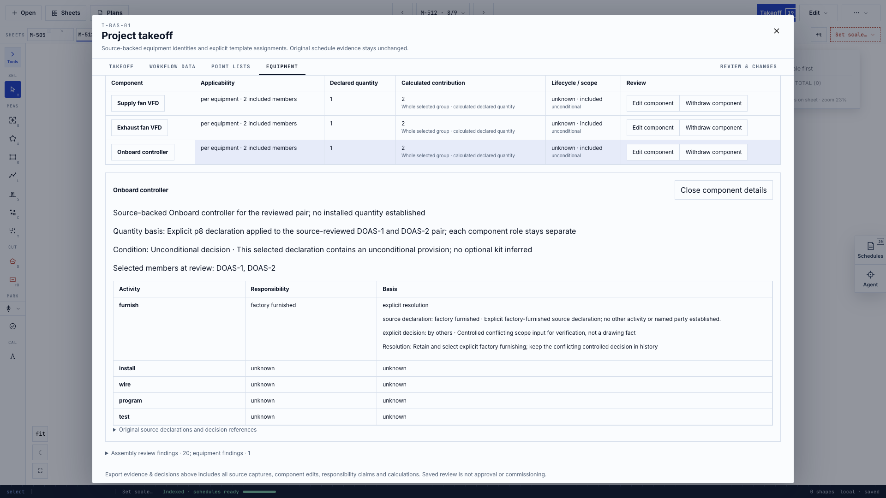
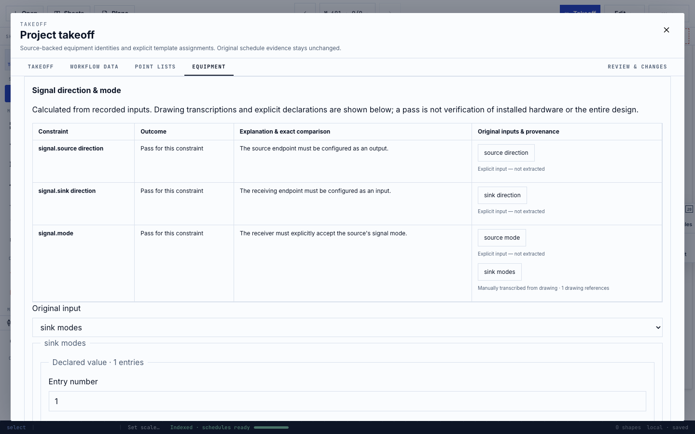
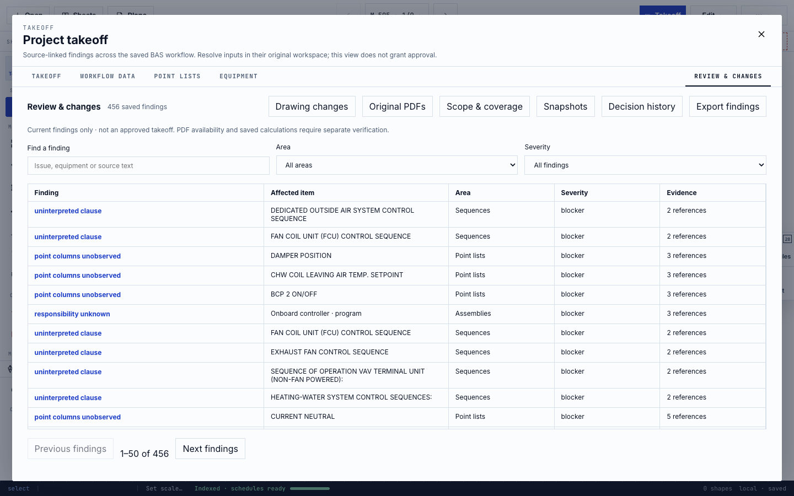
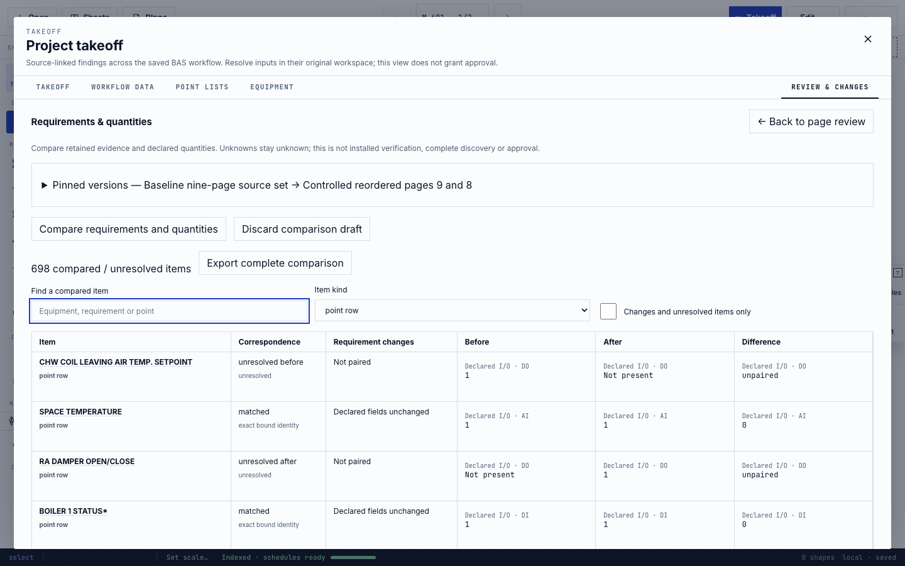
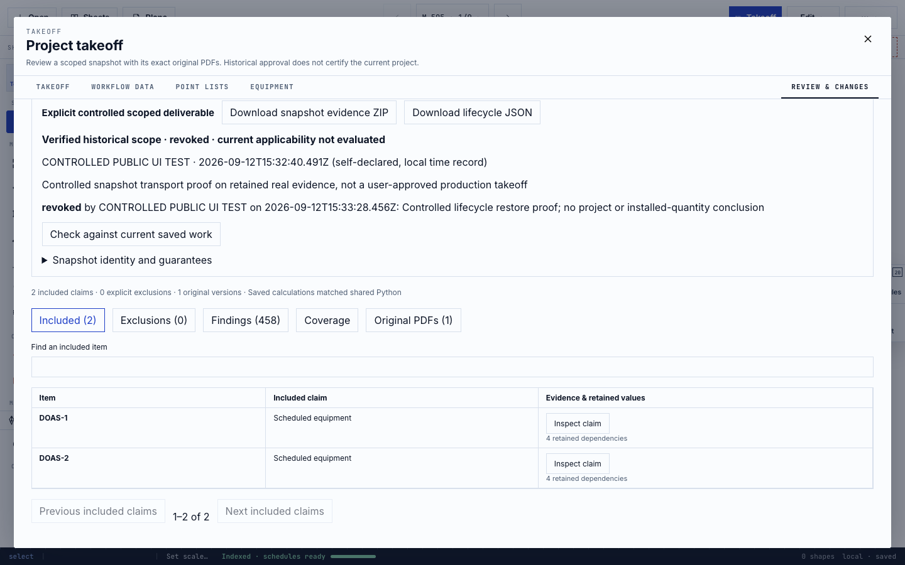

# BAS takeoff workflow walkthrough

This guide covers the five deterministic BAS workflows available from **Takeoff**.
They organize drawing evidence, explicit estimator decisions and shared Python
calculations. They do not replace estimator review, discover specification-book
requirements, or certify installed quantities.

## Before you begin

1. Open every drawing PDF that belongs to the current bid set.
2. Wait for **Indexed · schedules ready** in the canvas status bar.
3. Open **Takeoff**. The large workspace contains **Point lists**, **Equipment**
   and **Review & changes**; it does not add more canvas rails or permanent tools.
4. Keep the original PDFs. JSON exports retain evidence identities and decisions,
   while source-inclusive ZIP exports retain the PDF bytes as well.

The system automatically retains text, table cells, source locations, identities,
saved decisions and deterministic calculation results where the uploaded drawings
provide them. A person still decides applicability, ambiguous correspondence,
scope, responsibility, counterpart ratings, exceptions and release approval.

## 1. Review point lists and sequences of operation

Open **Point lists**. The first view is a digital matrix: original row and nested
column headings remain visible, blanks display as blanks, and a selected value can
open the exact source cell. Filtering changes only the view, never the underlying
evidence or totals.

1. Select a matrix, then select a row number to inspect its observations,
   controller qualifiers and unresolved columns.
2. Choose a printed value or **View source cell** to open the original page and
   outlined source box. Return to the workspace; the selection is preserved.
3. Export point evidence when you need the complete, unfiltered capture.
4. Choose **Sequences & links**. Read the retained source clauses before making
   any association.
5. Expand **Link a point list and equipment reference**, choose the exact matrix
   and source-backed equipment reference, state the established scope, enter a
   reason, preview, and save.
6. Review the comparison. Supported monitoring clauses show **Listed** or **Not
   listed in selected matrix**. Other clauses remain explicitly uninterpreted.

Automatic work: point/SOO discovery for supported vector-text patterns, original
reading order and geometry retention, deterministic supported-clause comparison,
source accounting, persistence and replay.

For explicit row-oriented **POINT FUNCTION SCHEDULE** tables, the shared path
retains the printed point name, tag and directional point type even when the
general table graph clipped rows. For marked **DDC POINTS LIST** and **BACNET
INTERFACE SCHEDULE** tables, exact printed AI/AO/BI/BO/DI/DO marks become
directional I/O observations while AV/BV/MI/MO/MSV remain separate software
values. A source-span recovery never invents alarm, trend, graphic or fail-mode
flags that were omitted by the graph; those columns remain visible as unobserved
release blockers until a person checks the drawing.

Human work: decide whether a clause applies, select the correct equipment/matrix,
resolve ambiguous text, explain the association and review unsupported clauses.
**Not listed** is never treated as proof that a point is absent from the project.

## 2. Bind templates to actual scheduled equipment

Open **Equipment**. The source table and the separate scoped register deliberately
show different truths: a printed schedule member is evidence that the drawing lists
it, not proof of a unique installed device.

1. Choose **Create scope** and enter only established building, level, system and
   phase values. Leave unknown values blank.
2. Select source-backed rows and choose **Register printed members**.
3. Select a registered member and inspect its exact schedule/source evidence.
4. Choose **Assign point list**. Select the matrix and explicitly choose **Per
   included equipment** or **Once for this system**.
5. Select included members, enter any source-backed or disclosed operator
   exceptions, attach applicable SOO/drawing references, and enter a reason.
6. Choose **Preview decision**, inspect the complete proposal, then **Record
   decision**. Any later edit invalidates the preview.
7. Choose **Calculate assigned values**. The shared Python service applies printed
   values using the recorded mode. Expand the result to see original value,
   factor, derived value and source cell.

Automatic work: stable source/equipment identities, literal member/range parsing
for supported forms, duplicate and stale-input detection, deterministic listed-
value application, source-linked results, durable replay and export.

Human work: establish scope, identity, applicability mode, included members and
exceptions. The calculation is a reviewed listed-requirement subtotal. It does
not prove field wiring or installed quantity. When unique nonoverlapping point
identities cannot be established, the project total remains withheld.

## 3. Build controls assemblies and assign responsibilities

With equipment selected, choose **Assembly & responsibilities**.

1. Choose **Add from drawing declarations** to review supported explicit drawing
   statements. The current deterministic grammar covers bounded declaration
   families such as distinct supply/exhaust VFDs and factory-furnished onboard
   controllers. It does not create a generic controls kit.
2. Select the equipment members to which the declaration applies, then review the
   quantity basis, condition, lifecycle, source and reason.
3. Use **Add explicit component** only for a disclosed estimator decision backed
   by selected drawing references. Leave quantity blank when not established.
4. Expand **Responsibility decisions** and record **Furnish**, **Install**,
   **Wire**, **Program** and **Test** independently. Factory furnished assigns
   only furnishing.
5. If evidence conflicts, use **Resolve responsibility conflicts explicitly**,
   retain the competing claims and record why one controls the takeoff.
6. Preview and save the complete assembly. For interdependent edits, stage every
   change and use the atomic multi-change preview/save.
7. Choose **Calculate assembly quantities** to run the shared Python calculation.

Automatic work: strict supported declaration parsing, source ownership, duplicate
consumption checks, separate physical/component identities, stale dependency
detection, deterministic group contributions and complete history retention.

Human work: applicability, conditional truth, explicit additions, all five
responsibility decisions, conflict resolution and exclusions. Responsibility is
takeoff scope—not proof that commissioning or installation occurred.

## 4. Check manufacturer-independent engineering compatibility

From selected equipment, choose **Engineering**. This workspace evaluates only
declared inputs. Missing ratings remain unknown; no catalog product is assumed.

1. Under **Declared resources**, add the relevant endpoint, supply, terminal,
   pool, module or network-location resource.
2. Under **Checks**, choose the constraint family and **New check**.
3. Enter source and counterpart direction, mode/range, power/loading, pool,
   expansion or network values as applicable. Attach exact drawing references to
   values transcribed from a drawing. Clearly label values supplied manually.
4. Stage related checks, then choose **Preview & calculate**.
5. Inspect every result as **Pass**, **Fail** or **Not evaluable**, including the
   governing rule, exact comparison and original input provenance.
6. Choose **Record engineering decision** only after reviewing all staged inputs.
   Later source/equipment/assembly changes make the result historical.
7. Use **Verify saved calculations** after reload/import, and export the separate
   engineering workbook when a portable review table is needed.

Automatic work: dimensional validation, exact constraint comparison, Python
calculation/replay, retained failures/unknowns, dependency freshness and source-
linked outcomes.

Human work: select what must be checked and provide absent counterpart ratings.
A pass means only that the declared inputs satisfy that constraint. It is not
verification of hidden hardware, routes, installation or the entire design.

## 5. Review findings, revisions and release snapshots

Open **Review & changes**.

### Findings

Use **Area**, **Severity** and search filters to triage the deterministic findings.
Select a finding to inspect its exact retained inputs and evidence. **View PDF
page** opens the original source; the domain button returns to the applicable
workspace for a real correction. Acknowledgement records awareness without
hiding the finding or changing quantities.

### Drawing revisions

1. Choose **Drawing changes**, create the baseline source set, then start a
   partial-addendum or replacement review against the incoming capture.
2. Account for every page by pairing, retaining, adding, removing or leaving it
   unresolved. Page numbers and filenames are not treated as sufficient identity.
3. Preview and record page accounting with a reviewer and reason.
4. Choose **Compare requirements & quantities**, select the two complete source
   sets and start the comparison.
5. Review unresolved correspondence. Record explicit pairs/additions/removals
   where evidence supports them, rerun the comparison, then save it.
6. Filter and inspect the complete before/after table. Unknown and incompatible
   quantities stay unknown; neither side is silently replaced with zero.

The pictured revision proof uses a clearly labeled page-reordered derivative of
a real PDF to test correspondence and persistence. It is not an issued addendum
and therefore does not prove accuracy on every real revision style.

### Approved takeoff snapshot

1. Under **Scope & coverage**, choose the source set, create the deliverable
   scope, include the intended claims, record explicit exclusions, and review
   source coverage.
2. Save the reviewed scope. A reviewed scope is not approved.
3. Open **Snapshots**, select the scope and choose **Check readiness**. The app
   verifies exact original bytes, calculation replay, dependencies, coverage and
   blocking findings.
4. Inspect **Included**, **Exclusions**, **Findings**, **Coverage** and **Original
   PDFs**. Enter a self-declared reviewer and reason and explicitly confirm scope.
5. Choose **Approve scope & save snapshot**. A fresh verification runs before an
   atomic, separate save.
6. Reopen the snapshot and choose **Check against current saved work**. Relevant
   changes prevent a current-match result.
7. If needed, explicitly revoke or supersede it. Lifecycle actions append history;
   they do not erase the original approval record.
8. Download both **snapshot evidence ZIP** and **lifecycle JSON**. To recover in
   an empty browser, import the ZIP, then the lifecycle JSON. Historical PDFs open
   read-only and do not replace active counting sheets or annotations.

Automatic work: bounded finding compilation, source/version ownership,
deterministic replay, dependency invalidation, full comparison exports, readiness
checks, atomic snapshot persistence and source-inclusive archive verification.

Human work: source-set correspondence, issue disposition, scope, coverage,
exclusions, reviewer identity, approval reason, release confirmation, revocation
and supersession. Browser-local records are not authenticated signatures or
server-enforced immutable records.

## Agent use

The existing Agent can inspect each deterministic workflow and open the right
workspace. Example requests include:

- “Inspect point-list and sequence coverage, then open Point lists.”
- “Show unresolved equipment-template assignments.”
- “Inspect assembly responsibility gaps for the current BAS workflow.”
- “Show engineering compatibility failures and open Engineering.”
- “Inspect review/revision/release readiness.”

The Agent receives bounded validated summaries through the same workflow records
used by the UI and MCP. It does not approve, revoke, supersede, invent counterpart
ratings or turn an unresolved installed quantity into a number. Final review and
all write decisions remain explicit user actions in their workspaces.

## Current boundaries

- No costing, pricing, labor or product selection is added by these workflows.
- No specification-book ingestion is included.
- No new OCR, raster vision, learned detector or symbol-recognition work is part
  of this implementation.
- A 29-page real project required a 4 GiB Node heap for the equipment browser
  walkthrough after the default 2 GiB graph build exhausted memory.
- A cold 31-page, 18.9 MB dense-vector holdout required about 13 minutes 44
  seconds and peaked at 1.91 GB RSS during full graph construction. Production
  compile then completed in 2.3 seconds. This is an honestly retained cold-path
  performance boundary, not hidden by a warm-cache number.
- The source-backed snapshot journey passes the separate 512 MiB incremental
  memory target in four independent clean processes. The narrowest observed
  margin was 1,638,400 bytes, so large-project headroom remains intentionally
  monitored rather than treated as unlimited.
- Physical installed quantity remains withheld unless adequate nonoverlapping
  evidence and explicit decisions establish a defensible unique total.
- These are human-in-the-loop takeoff controls. They deliberately refuse to turn
  incomplete drawing evidence into “project complete” or engineering certification.
