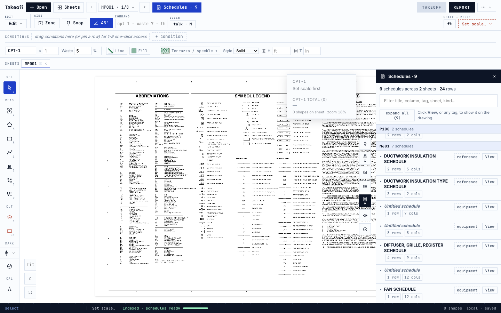
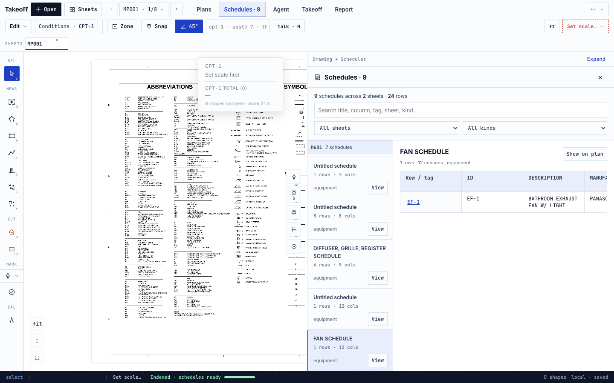
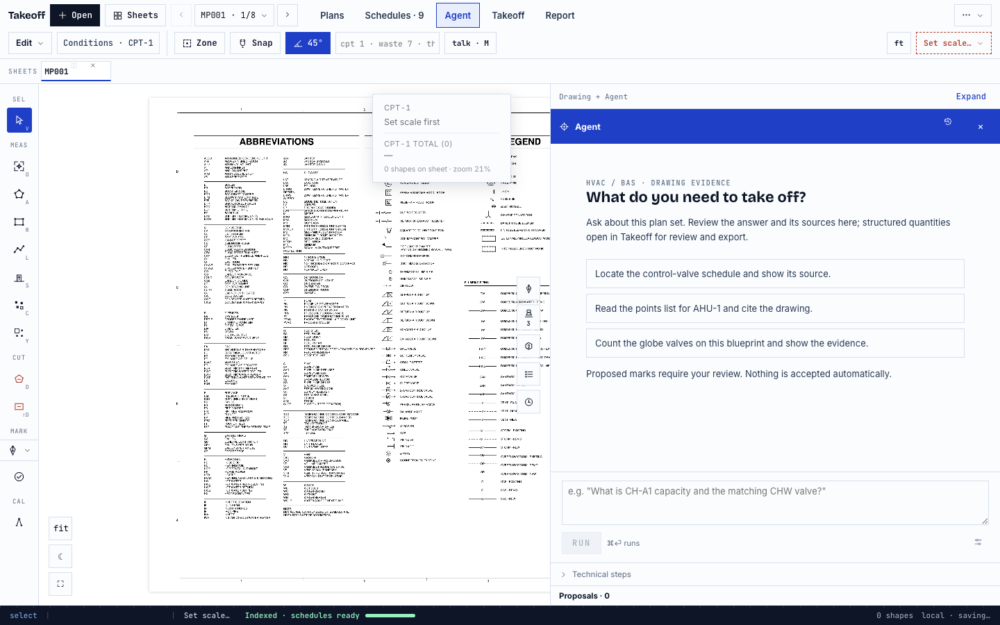

# Workspace UI rewrite — review and verification

Branch: `codex/ui-workspace-rewrite`. Baseline: `8414e3ae` (latest `origin/main`
when the clean worktree was created). Do not merge this branch until the full
release gates are green. The original dirty checkout was not modified.

## Scope decision

**SHOULD THIS BE ON THE SHARED PATH? NO.** This work is navigation, panel layout,
presentation, sizing, focus and UI verification. Session and the shared graph
remain the only owners of table truth. No files under `mcp/`, `server/` or
`opentakeoff-corpus/` are changed. The UI work itself does not modify shared
logic; a separately user-authorized lint-only exception touches three existing
`web/src/lib/` files, detailed below. No table/citation/bbox fields,
agent execution, proposal semantics, persistence schemas, totals or exports are
changed. The new localStorage keys contain only dock dimensions/expanded state.

## Changed surfaces

- Labeled Plans, Schedules, Agent, Takeoff and Report destinations.
- A compact toolbar and sheet strip: 121 CSS px total with the sample loaded.
- On-demand condition properties with outside-click/Escape dismissal and the
  existing shortcut pause mechanism.
- One primary dock at a time, sensible drawing space, pointer/keyboard resizing,
  expanded view and focus return. No fixed 360/380px primary panel.
- Schedules sheet navigator, search and sheet/kind facets, full cell grid,
  internal wide-table scrolling and selected-row feedback.
- Agent starter drafts, persistent composer, larger proposal review controls.
  All existing callbacks and argument ordering are retained.

## Verified locally

The bundled mechanical set yields **9 schedules / 2 schedule sheets / 24 rows**.
The entire graphTables output is compared, not just these totals. The exact
before/after evidence is in [baseline](ui-workspace/evidence/baseline/evidence.json)
and [after](ui-workspace/evidence/after/evidence.json).

- Schedule View paints one normalized `schedule_browse` box on its own sheet.
  Repeated views leave one box. A row paints its own smaller cell union.
  Closing removes browse highlights only.
- Agent citation navigation retains the original sheet/bbox payload.
- Two count proposals remain pending until an explicit accept/reject. Accept
  commits one count; Reject all removes the remaining proposal, not the shape.
- A clearly labeled UI-only query fixture appears in Workflow data but does not
  become a finished quantity. Its CSV and all visible takeoff data match before
  and after exactly. This fixture is not a model-generated takeoff result.
- Only transient object IDs, condition IDs and creation/acceptance timestamps
  are excluded from semantic comparison. Table IDs and all data geometry remain
  in the comparison.
- `npm test`: 2,515 passed, 0 failed, 13 skipped (2,528 tests).
- `npm run bench`: passed; committed benchmark results unchanged.
- `npm run build`: passed.
- Existing topbar driver: passed at 1280, 1440, 1920 and 2560 widths.
- Existing schedules, inline-citation and count-proposals drivers: passed on
  the real built-in sample.
- New workspace driver: **119 checks passed**, including navigation, active state, shell height, no page overflow,
  original grid cells/headers, filtering, split/expanded view, pointer/keyboard
  resize, focus return, and exact Agent callbacks. Synthetic Agent props exercise
  running/review states without a model request.
- The Agent fixture retains the real workspace rectangle below the toolbar and
  above the status bar, rather than assuming the entire 900px viewport is free.
  Four additional bounds checks prove running status, running/review composer,
  and pending-review heading fit inside that rectangle. The resulting light
  running and HUD review screenshots were inspected; these are deterministic
  component fixtures, not live-model output.
- Evidence clicks restore split view from an expanded workspace without changing
  the drawing footprint or the existing citation/highlight callback payload.
- Matched sample screenshots captured at 1280×800, 1440×900, 1920×1080 and
  2560×1440. These show Plans, selected FAN schedule, Agent empty and seeded
  answer/proposal review. HUD is captured at 2560. No screenshot is represented
  as a live model run.
- Expanded views additionally show the wide FAN and diffuser/grille/register
  schedules together, with their complete extracted grids and internal scrolling.
- Additional real corpus UI check passed on document 19, Orange County Regional
  History Center HVAC (nine-page set): four schedules / 11 rows on M-401, sheet 8.
  The AHU schedule has 35 columns. Every header and first-row cell was checked
  against the graph, and split/expanded/far-right-column screenshots inspected.
  Table/row navigation, idempotence, filtering, and highlight cleanup passed.
- GitHub's `ui-contracts` job passed on commit `05bbc38f` in
  [run 34290478079](https://github.com/erikjohnstone/master-plan/actions/runs/34290478079).
  This is distinct from the full release check.

## Separately authorized test typing

The user explicitly approved test-only typing fixes, preserving every assertion
and leaving all production/extraction code untouched. The 252 inherited
TypeScript diagnostics are resolved with type annotations/assertions in 16 test
files and a type-only fixture helper. No fixture values, runtime assertions,
production types, compiler options or lint rules were changed.

`node scripts/verify-test-runtime-parity.mjs 05bbc38f` compares executable
JavaScript before and after the typing edits, normalizing redundant parentheses
while preserving optional-chain boundaries. All 16 edited test files match.
The historical baseline/after logs still document the original UI-only state;
the separate `test-typing-*` evidence records this authorized follow-up.

The first post-typing unit run passed 2,514 tests and failed one unchanged
`mepconnectivity` wall-clock guard (64.31 seconds against 60 seconds) while
other validation jobs were running. An isolated rerun passed all 28 MEP tests,
with the dense-grid case taking 6.46 seconds. The failed concurrent run is kept
as evidence; no timing threshold or engine implementation was edited. Build
and benchmarks also pass after the typing changes.
The subsequent unmodified `npm test` run, without other validation jobs running,
passed **2,515 tests, 0 failed, 13 skipped** (2,528 total).

## Separately authorized lint-only cleanup

After the user delegated the decision in response to the explicit four-file
lint-cleanup question, the follow-up removes the 50 inherited lint errors:

- `agentLoop.js` and `takeoffWorkflow.js`: only redundant escapes; the former
  also loses one never-called arrow-function helper.
- `agentTakeoff.js`: unused local bindings become `_rowCount` and `_col`.
  The public `rowCount` property, its default/getter evaluation, function arity,
  and every call site are preserved.
- `TakeoffCanvas.jsx`: ten unused import bindings and one empty-catch binding
  are removed. Every import source and its evaluation order remain intact.

**Shared-path decision for this exception: YES for the existing shared-file
cleanup, NO for canvas imports and verification.** No UI/MCP fork is introduced.
No algorithms, matching rules, prompts, contracts or lint configuration change.
The three existing lint warnings remain; changing hook dependencies is outside
this behavior-preserving cleanup.

`node scripts/verify-lint-cleanup-parity.mjs c1b245a5` passes a whole-file parsed
structure comparison, permitting only the specified unused-binding/helper
removals and equivalent literal spellings. It verifies 654 regex literal
structures, identical cooked prompt/template text, unchanged raw tagged
templates, and scope-aware unused imports. The proof is separate from the
unchanged behavioral test suite.

The complete `npm run check` now passes: TypeScript, lint (0 errors / 3 inherited
warnings), 2,515 passing tests / 13 skipped, benchmarks, and production build.
The browser proof was repeated after cleanup against the original baseline:
all 9 tables, citation/bbox outputs, proposals, takeoff data and CSV still match.

## Open release gates — not claimed complete

1. The inherited **252 TypeScript errors and 50 lint errors are resolved** by
   the separately authorized typing and lint-only checkpoints. Three inherited
   warnings remain. No checks were hidden, ignored or weakened. The complete
   local check passes; CI must still be verified on the pushed cleanup commit.
2. `playwright-table-takeoff-ui.mjs --doc 05` and
   `playwright-takeoff-ui-demo.mjs hvac` were attempted but refuse to start
   without a live `CEREBRAS_API_KEY`. The user subsequently supplied a local key;
   authentication was verified, and live workflow validation is now pending.
   Deterministic UI callback and real graph/citation tests do not replace those
   live end-to-end gates.
3. This monorepo had no root `.github/workflows` directory; nested package
   workflows are not discovered by GitHub. The new root workflow runs the full
   check without relaxing it and runs the focused browser contracts separately.
   All required checks must be green before this is review-ready for release.
4. The available 30-document collection's document 05 (USDA APHIS Plant
   Inspection Station, Building 63) was attempted through the real schedules
   driver. It timed out after 900,000 ms waiting for schedule graph readiness,
   before reaching panel assertions. That larger corpus UI verification is
   **unverified**, not passed; the separate document 19 multi-sheet UI check
   succeeded as described above. No extraction or corpus files were changed.

## Reproduce

From `opentakeoff/web`, install package dependencies and MCP dependencies, then
run Vite on port 5176. Install the Playwright Chromium build with
`npx playwright install chromium`; alternatively set `OT_BROWSER_PATH` to a
local Chromium executable. No platform path is hardcoded in the updated drivers.

```sh
OT_UI_URL=http://localhost:5176 OT_UI_PDF=public/demo/sample-mechanical-set.pdf node scripts/playwright-workspace.mjs
OT_UI_URL=http://localhost:5176 OT_UI_PDF=public/demo/sample-mechanical-set.pdf node scripts/playwright-topbar.mjs --widths 1280,1440,1920,2560
OT_UI_URL=http://localhost:5176 OT_UI_PDF=public/demo/sample-mechanical-set.pdf node scripts/playwright-schedules-panel.mjs
OT_UI_URL=http://localhost:5176 OT_UI_PDF=public/demo/sample-mechanical-set.pdf node scripts/playwright-inline-cites.mjs
OT_UI_URL=http://localhost:5176 OT_UI_PDF=public/demo/sample-mechanical-set.pdf node scripts/playwright-count-proposals.mjs
```

Run `ui-workspace-proof.mjs` with `OT_PROOF_PHASE=baseline` on the baseline
checkout, and `OT_PROOF_PHASE=after` on this branch, sharing `OT_PROOF_OUT`.
The after pass asserts complete semantic equality and captures the screenshots.

## Representative comparison (1440×900)

Before:



After:




