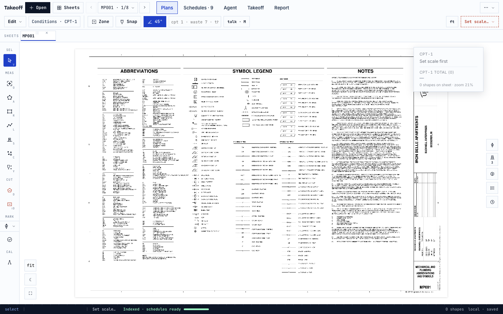
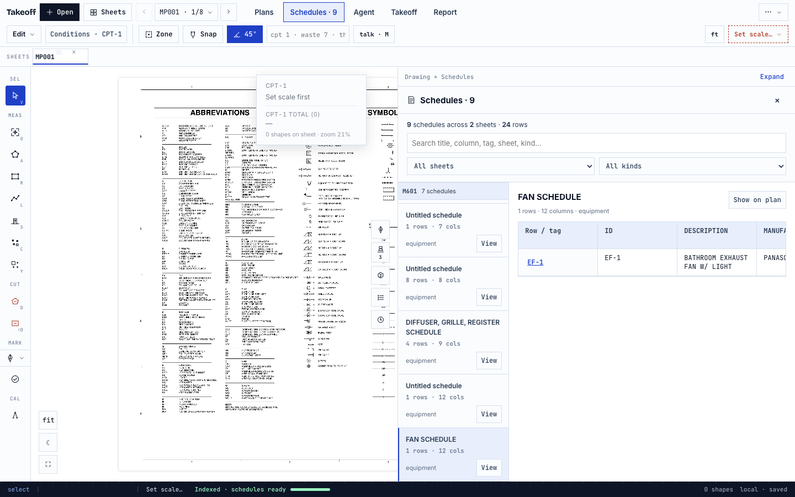
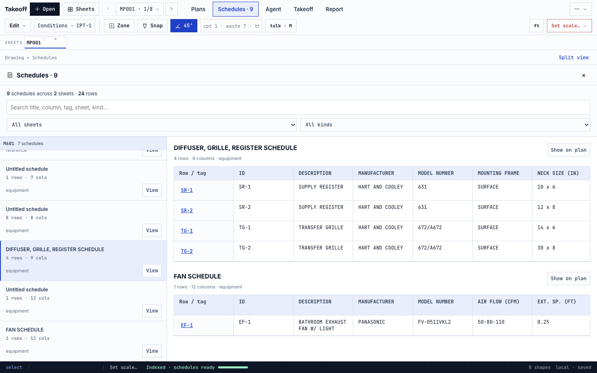
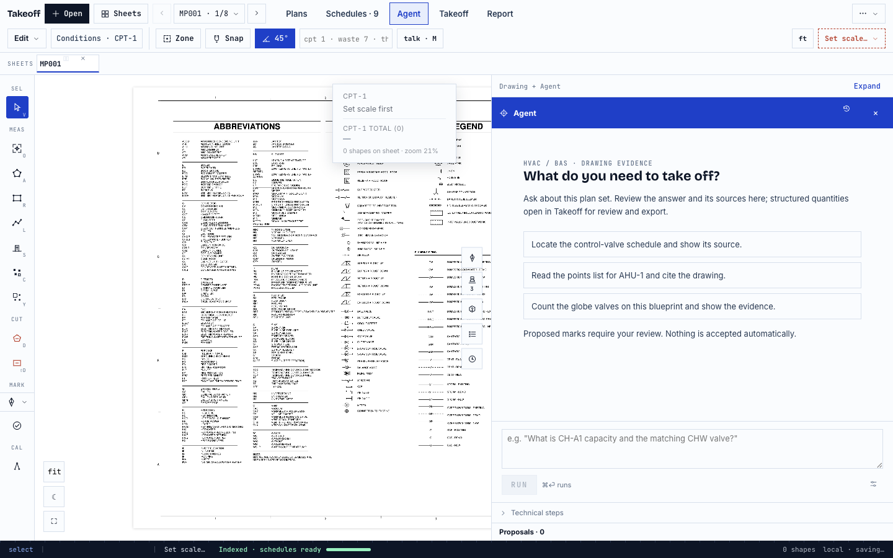
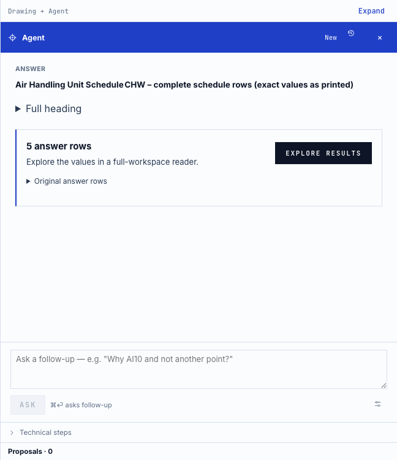
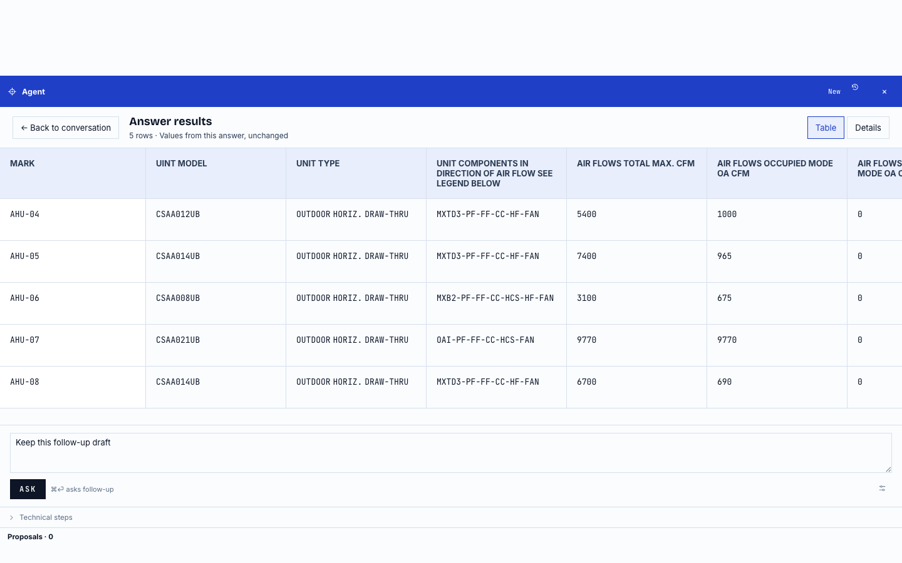
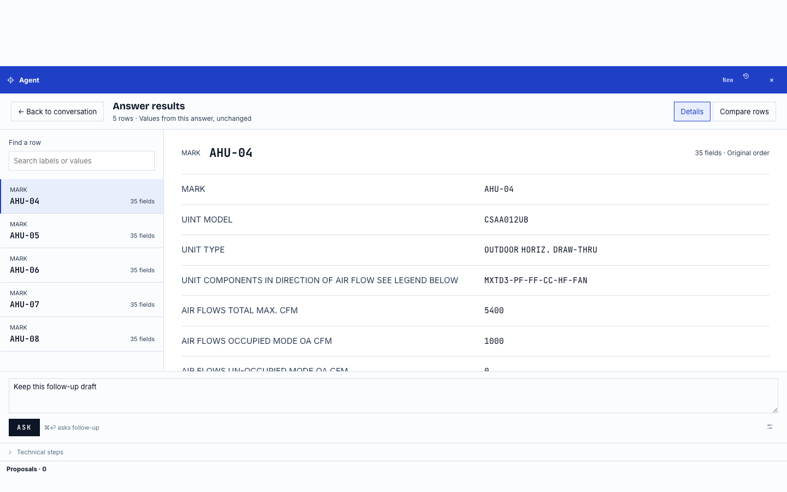

# Current UI — real-browser walkthrough

These are actual 1440×900 browser captures of the current UI branch with the
built-in mechanical PDF. They are not mockups or generated images. The displayed
schedule data comes from the existing extraction pipeline. No simulated Agent
answers or seeded proposals appear in these four screenshots.

## 1. Plans

Open a drawing and use the labeled Plans, Schedules, Agent, Takeoff and Report
destinations. The compact toolbar keeps drawing tools and scale accessible;
condition properties open on demand.

## 2. Schedules alongside the drawing

Choose Schedules, filter by sheet or kind, and select a schedule in the left
navigator. The detail grid retains the original headers and cells. View or a
row/tag link uses the existing source-highlight path.

## 3. Expand a wide schedule

Expand gives the table the main workspace. Wide columns scroll inside the grid.
Split view restores the drawing alongside it; source navigation also reveals
the drawing. This example shows the real diffuser and fan schedules.

## 4. Ask Agent

Agent is a labeled primary destination with a persistent composer. Starter
prompts fill the draft; they do not run or commit anything automatically.
Answers and sources stay here, structured output opens in Takeoff, and proposed
marks retain the existing explicit review gate.

This walkthrough demonstrates the UI, not a claim that a live takeoff has
passed. Live-model workflow results are documented separately from these views.

## 5. Explore a dense answer

The following are browser captures of the updated answer renderer replaying
the five real recorded answer rows from the table19 live run. This is a
presentation test, not a fresh model run or a claim of perfect transcription.
Explore results temporarily opens the full Agent workspace. **Table** is the
first/default view, with **Details** available for the row navigator and
individual-item reading. All 175 label/value pairs are checked against the
recorded response. Table is available only for rows with identical ordered
headers; incompatible rows open Details. Back/Escape returns to chat; a citation reveals the
drawing. The extraction engine is unchanged.

The earlier Details layout remains available as the secondary view:

