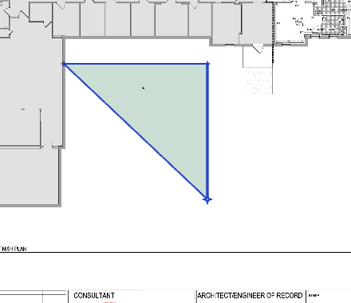
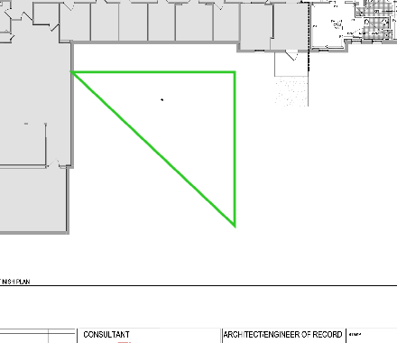
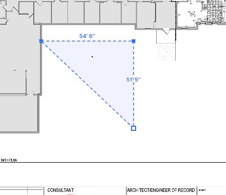
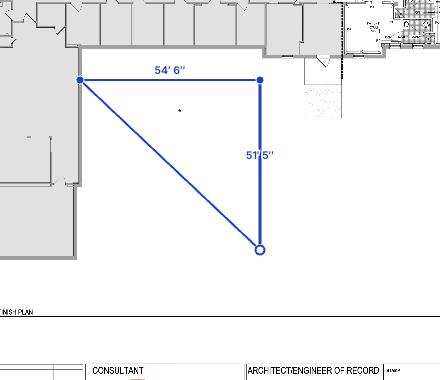
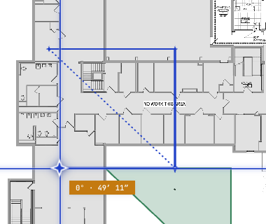

# Drawing Styles — themeable measuring-tool chrome

Scope: the *screen* look of the drawing/measuring tools — the in-draft
polygon, rubber band, vertex markers, crosshair, live readout chip, selection
handles, the symbol sweep-review overlay, and calibrate/check chrome. It never
changes what's *stored*: conditions keep their own color/hatch/line_style,
and exports and the marked-up plan PDF are untouched. This is a per-user
screen preference, not project data.

Source: `web/src/lib/drawStyles.js` (the token tables + resolver, pure and
unit-tested — no DOM) and `web/src/pages/TakeoffCanvas.jsx` (the consumer).

## Visual reference

Every image below is the **same three-point Area trace**, captured in the app
so the chrome is real (not a mock). The only thing that changes between the
four is the selected style.

<table>
<tr>
<td width="50%" valign="top">
<b>Drafting Table</b> — the default; identical to today's look. 
Solid cobalt stroke · star vertices · bold last segment · condition-color fill.
  

</td>
<td width="50%" valign="top">
<b>Contemporary</b> — high-contrast, minimal. 
Thick neon-green stroke · no vertex markers · no fill · dashed close-preview.
  

</td>
</tr>
<tr>
<td width="50%" valign="top">
<b>Precision</b> — surveyor's draft. 
Thin dashed stroke · square vertices · faint tint fill · <b>per-segment edge labels (all)</b>.
  

</td>
<td width="50%" valign="top">
<b>Site Glass</b> — legible over dense linework. 
Solid stroke with a <b>white casing halo</b> · dot vertices · <b>edge labels (last two)</b>.
  

</td>
</tr>
</table>

The default (Drafting Table) is pinned byte-for-byte against today's literals
by a unit test — see **Parity guarantee** below. Every claim in this section was
also checked against the running app — see [live verification](./drawing-styles-verification.md)
(claims-vs-live table, screenshots, and a capture).

### "Outline area while drawing" (opt-in behavior preference)

Independent of the visual style, **one** opt-in toggle changes *how* a
ring-tool draft is drawn while you place points — it has just two states,
OFF and ON. Default OFF preserves today's behavior; either way the shape
commits closed on `Enter` / double-click.

<table>
<tr>
<td width="50%" valign="top">
<b>OFF (default)</b> — the draft shows as a closed, filled polygon at every step (today's behavior).
  

</td>
<td width="50%" valign="top">
<b>ON</b> — the draft is an open outline (no fill, no auto-close), and once three
points are down a <b>dotted line previews the closing edge</b> the commit will add
(last vertex → first). The dotted ghost is part of ON mode, not a separate setting.
  

</td>
</tr>
</table>

## What ships

Four styles, `DRAW_STYLE_IDS` order:

| id | label | intent |
|---|---|---|
| `contemporary` | Contemporary | flat neon-green draft ink, no vertex markers, a self-intersection flip to red — the trace reads from the lines alone |
| `precision` | Precision | thin dashed draft stroke with a whisper fill tint, square vertices, a cream/pale readout chip |
| `drafting` | Drafting Table | today's OpenTakeoff look, unchanged — the default |
| `siteglass` | Site Glass | cased (white-halo) strokes and a translucent "liquid glass" chip docked to the last vertex, tuned for dense dark linework |

`drafting` is the default (`DEFAULT_DRAW_STYLE`) and is today's look, value
for value — see **Parity guarantee** below.

## Token schema

Screen-px numbers; the renderer divides every size by the live stage scale
(`tf.scale`). Every style spells out every field explicitly — there is no
defaulting or inheritance between styles.

| Field | Meaning |
|---|---|
| `accent` | draft stroke color (deduct red, and on ring tools an `invalidColor` flip, both win over it) |
| `draft.width` / `draft.lineWidth` | polygon+rect / linear+curve draft widths (the **surface** tool's draft polyline stays condition-colored, not accent — see Known deferred) |
| `draft.dash`, `draft.fillMode`, `draft.tintAlpha` | draft dash pattern; fill behavior (`"condition"` \| `"tint"` \| `"none"`) and its alpha |
| `lastSegWidth` | bold last-placed-segment cue; `null` = no bolding |
| `rubber.width/lockWidth/opacity/dash` | rubber-band (last vertex → cursor) styling; `lockWidth` applies while 45°-locked |
| `rubber.lockColor` | 45°-lock recolors the rubber band instead of thickening it; `null` = no recolor (keeps the lockWidth thickening instead) |
| `invalidColor` | ring-tool (area/deduct/zone) self-intersection flip color; `null` = the check never runs for that style |
| `vertex.shape/r/lastR` | in-draft vertex marker shape (`"star"` \| `"dot"` \| `"square"` \| `"diamond"` \| `"none"`) and radii |
| `selection.color/width/handleShape/handleFill` | selected-shape stroke and its vertex/edge grip styling |
| `chip.bg/fg/border/font/warnBg/warnFg/warnBorder` | the live readout chip's colors and font family; `warn*` is the amber roll-length caution state |
| `chip.chrome` | chip **layout**, not container styling (the chip `
` itself — padding/background/border — is chrome-flat across all four styles): `"paper"`/`"glass"` keep today's single-row live-segment text; `"panelDark"` (Contemporary) / `"panelCream"` (Precision) swap it for a small multi-row readout (This segment / Total linear / Total area, or condition head + Area/Linear/Segments/Points) built by `buildChipPanel` |
| `chip.anchor` | where the live chip is positioned: `"cursor"` (default, rides the pointer) or `"lastVertex"` (Site Glass — pins the chip to the last placed vertex instead) |
| `crosshair` | crosshair style (currently always `"hairline"` across all four) |
| `aimMark`, `aimMarkColor` | the crosshair's center marker shape/color (shared chrome — every drawing tool's cursor, including the count tool's placement cursor, reads this) |
| `symbol.seed`, `symbol.question` | symbol sweep-review overlay: the marquee'd seed ring and the open-question "?" mark |
| `closePreview` | a ring tool's (area/deduct/zone) ghost cursor→first-vertex closing edge, shown once at least two vertices are placed; `width`/`dash`; `null` = no ghost edge (Contemporary) |
| `edgeLabels` | live per-segment length labels drawn at each placed edge's midpoint while drafting: `"all"` (Precision, every edge) or `"last2"` (Site Glass, only the most recent two edges); `false` = none (Drafting Table, Contemporary) |
| `casing` | an under-stroke "casing" twin traced behind every draft stroke (rubber band, draft polygon/polyline, bold-last segment) and behind vertex markers when `vertex.casing` is also set — Site Glass's white (dark-inverts to near-black) halo that keeps dense dark linework legible; `{width, color}`; `false` = no casing |
| `vertex.casing` | whether the casing under-stroke also backs the in-draft vertex markers (only meaningful when `casing` is also set); `false` = vertex markers render bare |
| `dark` | sparse deep-merged overrides applied when the canvas is inverted (☾) |

`closePreview`, `edgeLabels`, `casing`, `vertex.casing`, `chip.chrome`, and
`chip.anchor` are all read in `TakeoffCanvas.jsx` as of `b60a7f0` — see
**Which styles show what**, below.

## Parity guarantee

`drafting` must render byte-identical to today's `main`. This is enforced,
not just asserted: `web/test/drawStyles.test.ts`'s `"drafting parity with
upstream"` block calls `resolveDrawStyle("drafting")` — the actual resolved
theme the renderer consumes, not the raw table — and pins every field
(`accent`, `draft.*`, `lastSegWidth`, `rubber.*`, `vertex.*`, `casing`,
`closePreview`, `edgeLabels`, `selection.*`, `aimMark`/`aimMarkColor`,
`symbol.seed`/`symbol.question`) as a literal against today's live
`TakeoffCanvas.jsx` values. A regression on the default style fails that
test before it fails anything visual.

## Tools covered

- **Ring/area tools** — area, deduct, zone: draft polygon stroke/fill,
  bold-last-segment, vertex markers, and (gated on `DS.invalidColor`, so
  `null` for `drafting`) a self-intersection flip to `invalidColor`, computed
  from the placed vertices via the new `ringSelfIntersects` predicate in
  `web/src/lib/geometry.js`. Also reads `DS.closePreview` (a ghost
  cursor→first-vertex edge once ≥2 vertices are placed — Contemporary) and,
  behind `DS.casing`, a white-halo under-stroke traced behind the draft
  polygon, the bold-last segment, and (with `DS.vertex.casing`) each vertex
  marker (Site Glass).
- **Linear tool** — draft polyline stroke/width/dash, plus the same
  `DS.casing` under-stroke twin as the ring tools. (The surface tool's
  polyline is deliberately condition-colored and un-cased — see Known
  deferred.)
- **Edge labels** — while any ring/linear tool is drafting (surface
  excluded), `DS.edgeLabels` draws a per-segment length label at each placed
  edge's midpoint: `"all"` labels every edge (Precision), `"last2"` labels
  only the two most recent edges (Site Glass), `false` labels none (Drafting
  Table, Contemporary). A segment spanned by a curve control point is
  skipped so a flattened arc never gets a floating chord label.
- **Rect / deduct-rect / symbol marquee** — the shared `rectRef` preview is a
  three-way branch: deduct and **deduct-rect** both draw danger red, the
  symbol marquee is themed via `DS`, and the schedule-selection marquee
  stays neutral at a fixed width regardless of style (see Known deferred).
  Wiring this branch also fixed a bug: deduct-rect previously fell through
  to the accent color instead of danger red like the ring-tool deduct did.
- **Count tool** — no committed-shape styling (see Known deferred), but its
  placement cursor rides the same shared crosshair/aim-mark chrome as every
  other tool.
- **Rubber band, crosshair, aim mark** — shared chrome used across all
  drawing tools, read from `DS`/`dsRef` in both the React render and the
  imperative per-mousemove movers. The rubber band also carries a
  `DS.casing` under-stroke twin (hidden while a curve bow is open, where the
  band is a dashed reference chord rather than a real edge).
- **Live readout chip** — colors/font from `DS.chip.bg/fg/border/font` as
  before, plus two newly-wired axes: `DS.chip.chrome` swaps the single-row
  live-segment text for a multi-row stats panel (`panelDark` on Contemporary,
  `panelCream` on Precision; `paper`/`glass` keep the single row), and
  `DS.chip.anchor` can pin the chip to the last placed vertex instead of the
  cursor (`"lastVertex"` on Site Glass).
- **Selection chrome** — the selected shape's stroke color/width and its
  vertex/edge grip shape and fill.
- **Symbol sweep-review overlay** — the marquee'd seed ring and the
  unresolved "?" verdict marks on the canvas now read `DS.symbol.seed` /
  `DS.symbol.question` instead of the old hardcoded `#7a00e6` / `#ff8c00`.
  Matched and accepted-question × markers are unchanged: they intentionally
  render in the armed condition's own color, not a style token.
- **Calibrate** — the calibration line, its star endpoints, and the
  alignment-point star follow `DS.accent`. The white halo stroke is
  unthemed.
- **Check** — the check line, its length label, and its star endpoints
  follow `DS.accent`. The scale-acceptance guide it can trigger is not
  themed (see Known deferred).

## Which styles show what

- **Drafting Table** — unchanged: every Task 7 token is off/default
  (`closePreview:null`, `edgeLabels:false`, `casing:false`,
  `vertex.casing:false`, `chip.chrome:"paper"`, `chip.anchor:"cursor"`), so
  none of it renders. See **Parity guarantee**.
- **Contemporary** — `closePreview {dash:[2,5], width:2}` draws the ghost
  cursor→first-vertex edge on area/deduct/zone; `chip.chrome:"panelDark"`
  swaps the live chip for a dark 3-row panel (This segment / Total linear /
  Total area) while drafting.
- **Precision** — `edgeLabels:"all"` labels every placed segment with its
  length; `chip.chrome:"panelCream"` swaps the live chip for a cream panel
  (condition head + Area/Linear/Segments/Points).
- **Site Glass** — `casing {width:4.5, color:"#fff"}` + `vertex.casing:true`
  draw a white (dark-inverts to `#0b0e14`) under-stroke behind every draft
  stroke and vertex glyph; `edgeLabels:"last2"` labels only the two most
  recent segments; `chip.anchor:"lastVertex"` pins the live chip to the last
  placed vertex instead of riding the cursor.

## Known deferred

Render paths that intentionally still use their pre-existing hardcoded
colors on this branch, not `DS`:

- **Surface polyline.** Renders in the active condition's color by design —
  it's meant to preview what the committed surface will look like, not read
  as generic draft ink.
- **Committed count pin.** The small filled square marking a placed count
  always renders with a white outline and the condition's fill color; it
  does not pick up `DS.vertex.shape` or any style token.
- **Markup previews** — cloud, callout, text, highlight box, and dimension
  line (`cloudRef`/`highlightRef`/`dimRef` and the shared markup-draft star)
  keep their own hardcoded colors. Markup tools were out of scope for this
  slice, which covers measurement chrome only.
- **Snap star.** The snap-to-plan indicator (`snapMarkRef`) keeps its own
  hardcoded green, independent of `DS.accent` or `DS.vertex.shape`.
- **Scale-acceptance guide.** The ephemeral calibrated ruler shown to sanity-
  check a scale visually is unthemed.
- **Schedule selection marquee.** The `rect` preview's neutral branch
  (`tool === "schedule"`) is a selection gesture, not a measurement, and was
  deliberately left out of the deduct-rect fix and the theming pass — cobalt
  stroke, condition fill, and a fixed `2px` stroke width regardless of the
  active style, so it never thickens under Site Glass or thins under
  Contemporary the way a themed measurement stroke would.
- **Highlighter.** Runs its own `HL_INKS` color palette, independent of
  drawing styles.
The HTML symbol status-panel "?" badge now reads `DS.symbol.question` too, so
the review panel and the canvas overlay stay in step across all four styles
(contrast checked against the `--paper-cream` panel: the per-style ambers sit
in the same legibility band as the prior hardcoded `#ff8c00`, and Precision's
darker `#d97706` reads better, not worse).

## Picker

A dropdown (`DrawStylePicker.jsx`) lives in the **⋯ overflow menu** (top-right
of the bar), directly under the light/dark chrome toggle and above the "Outline
area while drawing" toggle. Grouping it there is deliberate: chrome theme and
drawing style are the two appearance preferences, both set-once-and-forget, so
they belong together and out of the per-trace tool row where they would crowd
the work.

The control is a select-style face — the active style's mini SVG preview and
name — that opens a checked list of the four styles, each with the same
two-bend preview the sheet's own draft draws (accent, dash, vertex mark). It is
modeled on the toolbar's existing Line-Style and Label selects so it reads as
one more dropdown, not a panel, and keeps the drawing-style block one line tall
instead of the four-tile grid it started as. Picking an option calls
`setDrawStyle(id)`; the existing `onDrawStyleChange` round-trip repaints the
canvas live. It sits in a `custom` ToolMenu row, so selecting a style never
closes the ⋯ menu behind it — a style can be compared against the live draft.

## e2e coverage

This repo has no `web/e2e/` test harness (the private fork this was ported
from does, and has a drawing-styles e2e test). Porting that test is a
follow-up once an e2e harness exists here — it isn't being added as part of
this doc/changelog pass.
