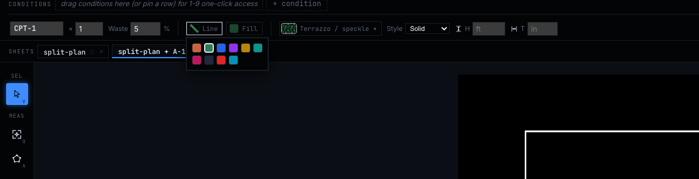
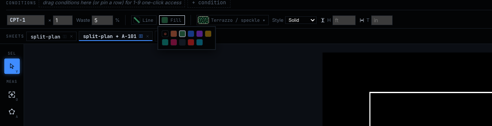
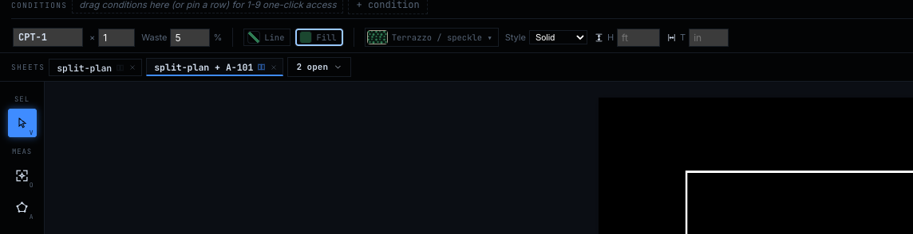
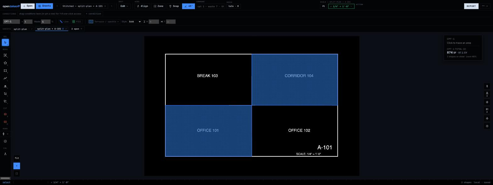

# Band color popovers — live verification

Every claim in [`BAND_COLOR_POPOVERS.md`](./BAND_COLOR_POPOVERS.md) was checked
against the running app (branch rebased on `main` at `ef1bb7b`, sample plan, CPT-1
with two committed rooms) before merge. Each row was confirmed by driving the real
control and reading the result on screen.

**Result: no deviations. The documentation matches the app.**

| Claim (from the doc) | Live result | ✓ |
|---|---|---|
| Band shows **Line** (diagonal stroke tile) and **Fill** (fill tile / ⦸) — no inline swatches | two buttons, zero inline swatches in the band | ✓ |
| Click Line → palette popover under the button | 6-column grid of `PALETTE`, current color ringed | ✓ |
| Click Fill while Line is open → Line closes, Fill opens, ⦸ leads | one popover at a time; ⦸ is the first cell | ✓ |
| Esc closes | closed; band unchanged | ✓ |
| Click outside closes | closed on canvas click | ✓ |
| Pick a color → shapes re-color, popover closes | both rooms and the hatch swatch went blue at once; popover gone | ✓ |
| Docked Takeoffs panel keeps inline palettes | 2 × PALETTE inline, unchanged | ✓ |

## Captures

| | |
|---|---|
|  |  |
| Line popover open | Fill popover open (⦸ first) |
|  |  |
| After Esc — closed | Picked blue — rooms re-colored, popover closed |
