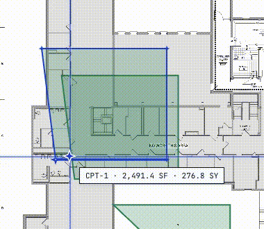
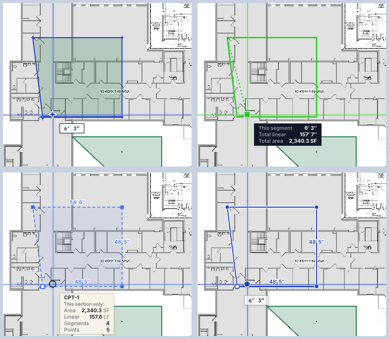
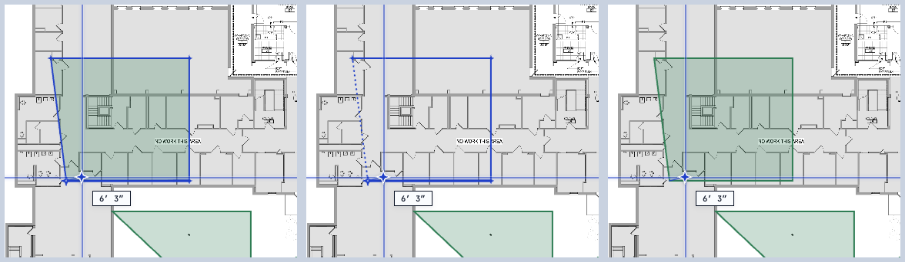

# Drawing Styles — live verification

Every claim in [`DRAWING_STYLES.md`](./DRAWING_STYLES.md) was checked against the
running app before this branch was staged. The trace used is a **four-point
Area draft** on purpose — with three segments it distinguishes "edge labels:
all" (Precision) from "edge labels: last two" (Site Glass), which a triangle
cannot. Each row was confirmed two ways: DOM inspection (element types, stroke
colors, dash patterns, label text, `data-draft` markers) and a screenshot.

**Result: no deviations. The documentation matches the app.**

| Claim (from the doc) | Live result | ✓ |
|---|---|---|
| **Drafting** — solid cobalt · star vertices · condition fill · no edge labels | cobalt stroke, green condition fill, star vertices, 0 edge labels | ✓ |
| **Contemporary** — thick neon-green · no vertices · no fill · dashed close-preview | neon-green stroke, no fill, no vertex markers, close-preview element mounted **and visible, dashed** | ✓ |
| **Precision** — dashed · square vertices · tint fill · edge labels (all) | dashed stroke, square vertices, faint tint, **3 labels across all 3 segments** | ✓ |
| **Site Glass** — solid + white casing halo · dot vertices · edge labels (last two) | **7 `data-draft="casing"` elements**, dot vertices, no fill, **2 labels — the top segment is unlabeled** | ✓ |
| **Outline OFF (default)** — closed, filled draft | `<polygon>` with fill; 0 open polylines; 0 ghost | ✓ |
| **Outline ON** — open outline + dotted closing ghost (once 3 points down) | 1 open `<polyline>` + **1 dotted ghost line** (1-on/5-off, round cap) | ✓ |
| **Commits closed either way** — `Enter` / double-click | shape count **7 → 8**, in-progress draft cleared, committed shape closed + filled | ✓ |

## Live capture

One draft, cycling all four styles, then toggling "outline while drawing" ON
(open outline + dotted closing ghost) and back to OFF:

## The four styles (same four-point trace)

## Outline preference (OFF / ON / after commit)

## One caveat (not a deviation)

The Drafting Table doc line says "bold last segment." That cue **is** configured
(`lastSegWidth: 3.5` vs the base stroke `2`) and renders, but it is visually
subtle at working zoom — it was confirmed from the token/render code rather than
isolated in a screenshot the way every other attribute was. The behavior is
correct and intended; the phrasing is just the one claim that is technically
true rather than obviously visible.

Screenshots are real app captures on the bundled sample plan; the chrome renders
in screen space, so it is crisp regardless of plan zoom.
