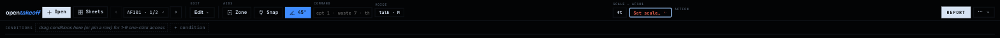
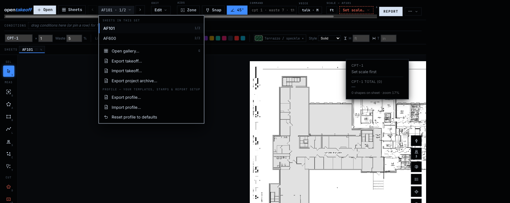
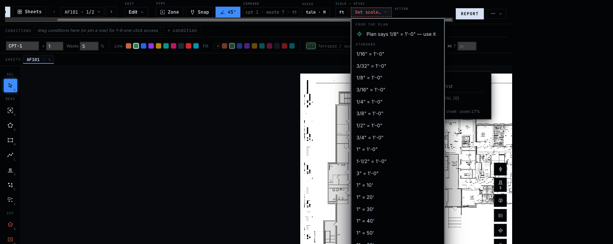

# Top bar pinned actions — live verification

Every claim in [`TOPBAR_PINNED_ACTIONS.md`](./TOPBAR_PINNED_ACTIONS.md) was checked
against the running app (branch rebased on `main` at `ef1bb7b`, sample plan) before
merge. Widths were emulated by constraining the document to 1366 / 1280 / 1024 px
and measuring with `getBoundingClientRect`; menus were opened for real.

**Result: no deviations. The documentation matches the app.**

| Claim (from the doc) | Live result | ✓ |
|---|---|---|
| Report right edge inside the frame at 1366 / 1280 / 1024 | **1291 / 1205 / 949** — identical to the design doc | ✓ |
| ⋯ pinned beside Report at every width | 1352 / 1266 / 1010 | ✓ |
| Scroll region `scrollWidth` constant (controls unchanged) | 1348 at every width | ✓ |
| Menus are `position: fixed`, so the `overflowY: hidden` region cannot clip them | sheet-chip menu and Scale dropdown open fully over the canvas at 1366 | ✓ |
| Full width pixel-identical | no overflow; Report in its previous place | ✓ |

## Observed, not a defect

At 1366 the **Action** cluster (Finish / Create when a trace is armed) is the part
of the strip that sits past the right edge until the region is scrolled. `↵` and
double-click still finish a shape. Whether Action should join the pinned group is
a follow-up decision, not part of this change.

## Captures

| | |
|---|---|
|  |  |
| 1366 — Report and ⋯ on screen, strip scrolls | Full width — unchanged |
|  |  |
| Sheet-chip menu, unclipped | Scale dropdown, unclipped |
