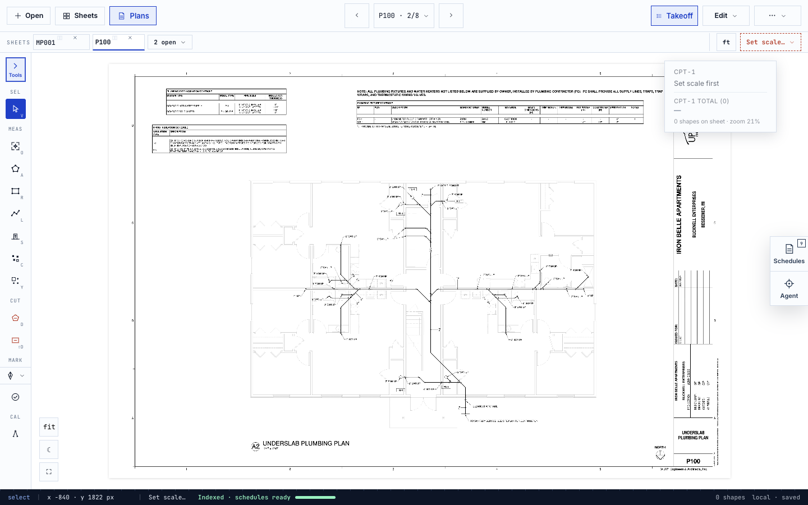
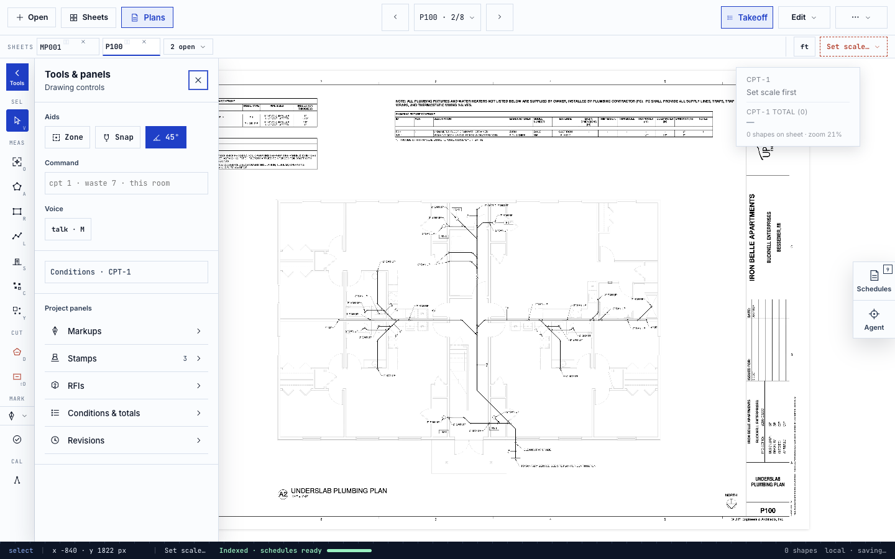
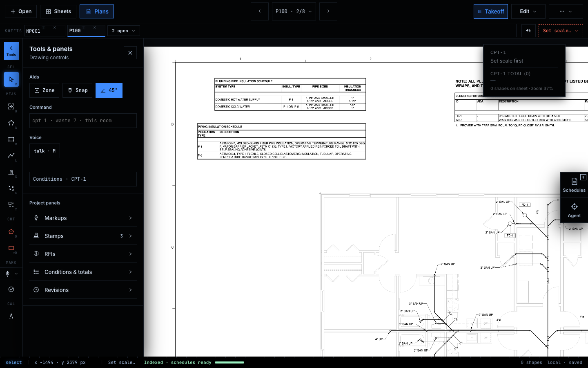

# Primary navigation and expandable tools rail

User-directed follow-up to #89. Baseline: `dec0151f` on main.

## Layout

- Open, Sheets and Plans form one compact file-navigation group on the left.
- Previous/current/next sheet form the larger centered navigation spine.
- Equal-sized Takeoff, Edit and overflow controls form the upper-right action
  group; the redundant product wordmark is removed.
- Schedules and Agent are compact tabs stacked at the vertical center of the
  canvas's right edge, floating over the workspace instead of claiming a column.
- Units and scale moved to the far right of the sheet-tab row.
- The left rail's Tools tab reveals a second column. Zone, Snap, angle guides,
  labels, Command, Voice and contextual Finish/Create actions moved here.
- Condition properties and the former right-edge utility buttons live in this
  column. Utilities have full-width labeled rows, not unexplained icons.
- Report is no longer a primary tab. The existing legacy report remains under
  More → Measurement report; Takeoff exports are unchanged.
- The flyout overlays the drawing without resizing it. Its command input stays
  mounted while collapsed. Escape restores focus; inner condition properties
  close before the containing flyout. Selecting a project panel closes the flyout.

## Shared-path gate

**Should this be on the shared path? No.** This is canvas chrome, layout and
navigation only. No changes to `web/src/lib`, MCP, server, extraction, prompts,
tables, quantities, citations, bounding boxes, project persistence or export data.

The original JSX event bindings were compared using the TypeScript parser,
ignoring formatting/comments. The only replaced bindings were:

- utility `onClick` forwards the original event after closing the UI flyout;
- the Report button's existing `setShowReport(true)` action moved into the
  overflow menu's `onSelect`.

The other new bindings open/close the flyout and handle its Escape key.
Original drafting controls, navigation, condition changes, citation, proposal,
Agent and export handlers were not rewritten.

## Verification

`playwright-workspace.mjs`: **206 checks passed**, zero browser errors.
Sizes: 1280×800, 1440×900, 1920×1080 and 2560×1440. Includes original schedule
headers/cells, citation payloads, Agent Run/Stop/proposal callbacks, resizing,
focus mode, flyout positioning, draft retention, toggle state, utility routing
and legacy report access. Light and HUD screenshots visually inspected.

`npm run check`: passed typecheck, lint (existing warnings only), **2,559 tests**
with 13 existing skips, the unchanged benchmark gates and production build.
Additional UI regression results are recorded in the pull request.

## Actual app screenshots

The built-in mechanical sample, opened through the real UI; no mockup data or
image editing. These captures document layout, not extraction accuracy.

